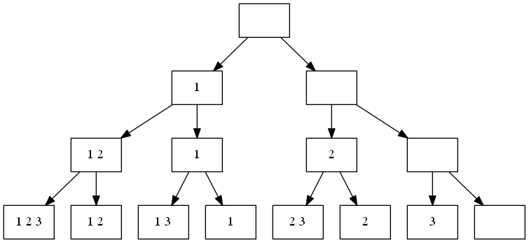
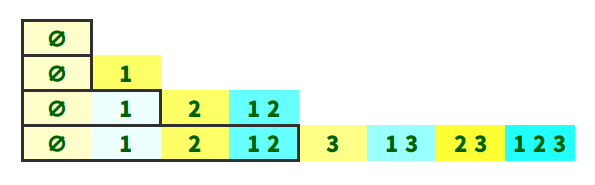
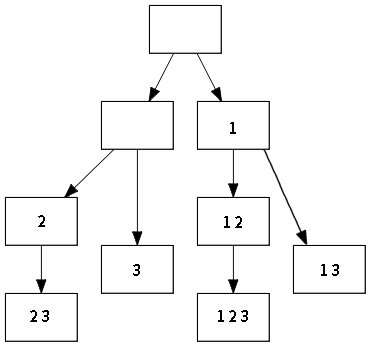
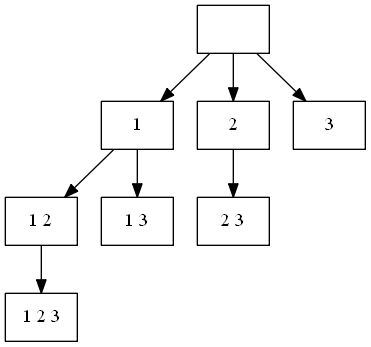

# 求集合的幂集的算法总结
　　幂集（Power Set）， 就是原集合中所有的子集（包括全集和空集）构成的集合。设集合A有n个元素，则集合A的幂集P(A)中含有2^n（2的n次幂）个元素。  
　　求集合的幂集，由于集合的幂集中有２的ｎ次幂个元素，所以求幂集的时间复杂度至少是Ｏ(2^n)。虽然时间复杂度高计算量大，但是，求一组解、求全部解或求最优解等问题可以在求幂集的过程中进行优化和实现。我的一个算法需要在求幂集的基础上进一步操作，所以选择一个求幂集的高效的算法十分必要。本文是我对所想到和看到的所有求幂集，以及求符合条件的幂集的子集的的算法的一个总结。  
　　经过性能测试，**算法5**的**性能最优**，选用其为默认算法，应用在“./lib/powerSet.js”中。**算法3**的**性能次优**，也是我最喜欢的算法之一，推荐大家使用。

## 算法1. 递归回溯法
### 求集合的幂集
　　基于递归思想的算法，虽然在函数调用栈上会有些耗，但是其思想和代码却十分简单清晰。我所想到的第一个算法就是基于递归思想的回溯法。  
　　**回溯法**，是设计递归过程的一种重要方法，它求解过程的实质是一个**深度优先**的**先序遍历**一颗“**状态树**”的过程，只是这棵树不是遍历前建立的，而是隐含在遍历过程中。回溯法实际上是一个类似于枚举的搜索试探的过程，当发现已经不满足求解条件时，就“回溯”返回，尝试别的路径。其中，满足回溯条件的状态节点成为“回溯点”。回溯法有“通用解题方法”的美称，可以解决很多复杂的、规模较大的问题。  

　　**算法的基本思想**，由于对于原集合的幂集中的任意一个元素子集，原集合中的任意一个元素只有两种状态，一种是属于这个元素子集，一种是不属于这个元素子集。以求一个元素的集合Ａ={1}为例，集合Ａ的幂集为P(A)={{1},∅}。因此求幂集的过程，可以理解成是对于原集合中所有元素依次进行“**取**”（添加）与“**舍**”（不被添加）的过程。  
　　基于递归的思想，原集合中的前i个元素的幂集只需要在第前i-1个元素的幂集分别进行添加第i个元素与不添加第ｉ个元素（即保持原来的不变），就可以求到前i个元素的幂集。幂集的初始元素是∅，并在此基础上开始添加与不添加的分化过程。  
　　求幂集的过程可以看做是**先序遍历**一颗**状态二叉树**的过程。求三个元素Ａ={1, 2, 3}的集合的幂集P(A)={{1, 2, 3}, {1, 2}, {1, 3}, {1}, {2, 3}, {2}, {3}, ∅}的状态二叉树如下图所示。树的根节点是幂集的初始元素空集∅，树的所有叶子节点就是原集合的幂集Ｐ(A)中的所有元素。集合的第ｉ层是已经对原集合Ａ的前ｉ-1个元素进行了取舍处理的状态(左分支表示取，右分支表示舍)。



　　算法的javascript代码实现如下。

```
/**
 * 通过递归回溯法求集合的幂集
 * @param  srcList   待求幂集的原集合
 * @return powerList 原集合的幂集
 */
function powerSet(srcList) {
  let tmpList = [], // 临时存放一个幂集元素的集合
    powerList = [], // 幂集
    srcLen = srcList.length; // 原集合的长度

  /**
   * 进入函数时，已经对前i-1个元素做了取舍处理，取得了前i-1个元素的幂集
   * 现在从第i个元素进行取舍处理，取得前i个元素的幂集
   * 直到到达叶子节点，即i===n时，求得原集合的幂集
   * @param i  原集合中元素的位置
   */
  (function recurse(i) {

    if (i === srcLen) { // 当达到树的最后一层
      powerList.push([...tmpList]); // 将此集合添加到最终的幂集集合中
    } else {
      let x = srcList[i]; // 取出srcList的第i个元素
      tmpList.push(x);    // tmpList添加第i个元素
      recurse(i + 1);     // 左加，然后进行下一层的递归
      tmpList.pop();      // tmpList除去第i个元素
      recurse(i + 1);     // 右减，然后进行下一层的递归
    }
  })(0); // 从第一个元素开始递归调用

  return powerList;
}

let list = [1, 2, 3];
let powerList = powerSet(list);
console.log(powerList);
```
　　输出结果
```
[ [ 1, 2, 3 ], [ 1, 2 ], [ 1, 3 ], [ 1 ], [ 2, 3 ], [ 2 ], [ 3 ], [] ]
```
　　通过上图可以看到元素{1}，{2}，{1, 2}，∅都有冗余的重复节点，而且，随着树的层数越高冗余的节点数也越高。从算法3开始将着重解决这个问题。

### 求符合条件的幂集的子集
　　求集合的幂集的“**状态二叉树**”是一颗满树（此处为满二叉树），树中每一个叶子结点的状态都是一个问题的解。然而在实际应用中，很多问题的解并不是一颗满树。当在试探的过程中节点出现的状态和问题的解产生矛盾的时候，就不应该再继续试探下去。因为这个节点不符合解的约束条件，则以该节点为根的子树上的所有节点都不会符合解的约束条件。这类问题的求解过程可以看成是在约束条件下进行先序遍历，并在遍历过程中**剪去**（prune）不符合条件的分支的过程。  
　　很多时候，求集合的幂集不是目的，真正的目的是通过求解过程的剪枝，最后得到符合限定条件的幂集的子集，如求一组解或最优解等问题。  
　　下面我们就以求集合的幂集中元素集的和不大于某值的集合。算法的javascript代码实现如下。

```
/**
 * 通过递归回溯法求集合的幂集中元素集的和不大于某值的集合
 * @param  srcList   待求幂集的原集合
 * @param  num       幂集中元素集的和不可大于num
 * @return powerList 符合条件的幂集的子集
 */
function powerSetPruneBySumMoreThen(srcList, num) {
  let tmpList = [], // 临时存放一个幂集元素的集合
    powerList = [], // 符合条件的幂集的子集
    srcLen = srcList.length, // 原集合的长度
    sum = 0;　// 集合中元素的和

  /**
   * 进入函数时，已经对前i-1个元素做了取舍处理，取得了前i-1个元素的符合条件的幂集的子集
   * 现在从第i个元素进行取舍处理，取得前i个元素的符合条件的幂集的子集
   * 直到到达叶子节点，即i===n时，求得原集合的符合条件的幂集的子集
   * @param i  原集合中元素的位置
   */
  (function recurse(i) {

    sum = 0;　// 重置sum为0
    for (let x of tmpList) {
      sum += x;
      if (sum > num) return; // 如果集合的和大于num则返回
    }

    if (i === srcLen) { // 当达到树的最后一层
      powerList.push([...tmpList]); // 将此集合添加到最终的幂集集合中
    } else {
      let x = srcList[i]; // 取出srcList的第i个元素
      tmpList.push(x);    // tmpList添加第i个元素
      recurse(i + 1);     // 左加，然后进行下一层的递归
      tmpList.pop();      // tmpList除去第i个元素
      recurse(i + 1);     // 右减，然后进行下一层的递归
    }
  })(0); // 从第一个元素开始递归调用

  return powerList;
}

let list = [1, 2, 3];
let powerListSumLessThen3 = powerSetPruneBySumMoreThen(list, 3);
console.log(powerListSumLessThen3);
```
输出结果
```
[ [ 1, 2 ], [ 1 ], [ 2 ], [ 3 ], [] ]
```

## 算法2. 状态二叉树的层次遍历
### 求集合的幂集
　　回溯法是对于“状态树”的深度优先的先序遍历。面对一颗树除了深度优先的先序遍历，一定还有一种**广度优先**的**层次遍历**。无论是深度优先还是广度优先的算法都有其具体的应用场景。借鉴树的层次遍历的思想，可以实现第二种求幂集的算法。树的层次遍历通常通过队列数据结构来实现。这种算法，除了增加了一种广度优先的遍历次序以外，还没有了递归的调用栈溢出等问题。  
　　**算法的基本思想**，利用队列辅助层次遍历算法１中的“状态二叉树”。初始队列为空集，依次出队，出队之后的元素集合，对于原集合中对应的元素依次进行“取”（添加）与“舍”（不被添加），然后重新入队，直到队列的元素个数为幂集的个数，或原集合中的所有元素都被取舍后（即超过了树的高度后），幂集求解完毕。  

　　算法的javascript代码实现如下。

```
/**
 * 通过状态树的层次遍历求集合的幂集
 * @param  srcList   待求幂集的原集合
 * @return powerList 原集合的幂集
 */
function powerSet(srcList) {
  let queue = [{data:[],level:0}], // 计算过程中的幂集队列，初始值：空集
    powerList = [], // 最终返回的，值包含值的幂集
    srcLen = srcList.length, // 原集合的长度
    powerSetLen= Math.pow(2,srcLen), // 幂集的个数
    node = []; // 一个幂集的元素集

   while(queue.length < powerSetLen){ // 当队列中元素个数为幂集个数时，停止
	node = queue.shift(); // 出队

	queue.push({data:node.data.concat(srcList[node.level++]),level:node.level}); // 添加新元素，然后入队
	queue.push(node);     // 重新入队
   }

   for(let x of queue){
	 powerList.push(x.data);
   }

  return powerList;
}

let list = [1, 2, 3];
let powerList = powerSet(list);
console.log(powerList);
```
　　输出结果
```
[ [ 1, 2, 3 ], [ 1, 2 ], [ 1, 3 ], [ 1 ], [ 2, 3 ], [ 2 ], [ 3 ], [] ]
```
### 求符合条件的幂集的子集
　　下面我们就以求集合的幂集中元素集的和不大于某值的集合。求解过程中将不符合条件的节点不入队，等同于回溯法的剪枝操作。由于经过剪枝的队列的元素个数小于幂集的个数，所以算法的结束条件也需要转变为当原集合所有元素遍历完成，即在状态树上表示为超过了树的高度。  
　　算法的javascript代码实现如下。  

```
/**
 * 通过状态树的层次遍历求集合的幂集中元素集的和不大于某值的集合
 * @param  srcList   待求幂集的原集合
 * @param  num       幂集中元素集的和不可大于num
 * @return powerList 符合条件的幂集的子集
 */
function powerSetPruneBySumMoreThen(srcList, num) {
  let queue = [{data:[],level:0}], // 计算过程中的幂集队列，初始值：空集
    powerList = [], // 最终返回的，值包含值的幂集
    srcLen = srcList.length, // 原集合的长度
    node = [], // 一个幂集的元素集
    data = [], // 临时存放幂集的一个元素集
    sum = 0;　 // 集合中元素的和

   while(true){

	node = queue.shift(); // 出队

	if(node.level == srcLen){ // 当原集合所有元素遍历完成，即超过了状态树的高度
		queue.unshift(node);  // 将从列表中移出的数据再添加回去
		break; // 求得幂集，循环结束
	}

	data = node.data.concat(srcList[node.level++]); // 像幂集的元素集中添加新元素

	sum = 0;
	for(let x of data){
	      sum += x;
	      if (sum > num) break; // 如果集合的和大于num，则退出循环
	}

	if(sum<=num){ // 将符合条件的集合加入队中，不符合条件的不入队，等同于回溯法的剪枝操作
		queue.push({data,level:node.level}); // 添加新元素，入队
	}
	queue.push(node);   // 重新入队

	}

   for(let x of queue){
		 powerList.push(x.data);
	   }

	  return powerList;
}

let list = [1, 2, 3];
let powerListSumLessThen3 = powerSetPruneBySumMoreThen(list, 3);
console.log(powerListSumLessThen3);
```

## 算法3. 状态二叉树层次遍历的改进算法
### 求集合的幂集
　　在算法１和算法２中的"状态二叉树"中有很多冗余节点，在算法２中每一个节点出队之后，又要被重新添加到队中，这一操作即没有必要又浪费性能。算法３在算法２的基础上进行改进，新算法中的线性存储结构可以被想象成一个“只进不出，并且可以读取任意位置值的队列”。这样每次不需要出队，且每次只向队尾添加一个元素。  
　　在算法2中为了确定出队的元素需要添加原集合中的第几个元素，所以增加了辅助的位置属性（level)。但是新的算法却不需要这些辅助属性。由于求幂集的过程，可以理解成是对于原集合中所有元素依次进行“**取**”（添加）与“**舍**”（不被添加）的过程。队列的初始状态为空集。求第一元素的幂集，则在空集的基础上添加第一个元素，与不添加第一个元素，即P({1})={∅,{1}}。求前i元素的幂集，则在已有队列中前i-1个元素的幂集的基础上进行“取”“舍”，即保持队列现有元素不变得到“舍”状态的一半幂集，在此基础上依次添加第i个元素得到“取”状态的一半幂集，将“取”状态的幂集添加到队列，求得前i个元素的幂集。算法的结束条件为，原集合的所有元素都遍历完成。　　

　　算法的求解过程的队列表示过程图如下所示。图中的队列的已经被框起来的前半部分表示已经求道的前i-1个元素的幂集，后半部分是在前半部分的基础上生成的前i个元素的另一半幂集。其中颜色相近的元素表示，后面的元素是在前面元素的基础上生成的。



算法的求解过程的状态树表示过程图如下



　　算法的javascript代码实现如下。

```
/**
 * 通过状态树的层次遍历求集合的幂集
 * @param  srcList   待求幂集的原集合
 * @return powerList 原集合的幂集
 */
function powerSet(srcList) {
  let srcLen = srcList.length, // 原集合的长度
    powerList = [[]];          // 幂集

  for (let i=0; i < srcLen; i++) { // 遍历原集合
    for (let j = 0, len = powerList.length; j < len; j++) { // 遍历已经求得的前i-1个元素的幂集，生成前i个元素的幂集
      powerList.push(powerList[j].concat(srcList[i])); // 依次将在现有幂集元素集上添加第i个元素的集合添加到队尾
    }
  }

  return powerList;
}

let list = [1, 2, 3];
let powerList = powerSet(list);
console.log(powerList);
```
　　输出结果
```
[ [], [ 1 ], [ 2 ], [ 1, 2 ], [ 3 ], [ 1, 3 ], [ 2, 3 ], [ 1, 2, 3 ] ]
```

### 求符合条件的幂集的子集
　　下面我们就以求集合的幂集中元素集的和不大于某值的集合。求解过程中将不符合条件的节点不入队，等同于回溯法的剪枝操作。算法的结束条件与不变，仍为原集合所有元素遍历完成。  

　　算法的javascript代码实现如下。  

```
/**
 * 通过递归回溯法求集合的幂集中元素集的和不大于某值的集合
 * @param  srcList   待求幂集的原集合
 * @param  num       幂集中元素集的和不可大于num
 * @return powerList 符合条件的幂集的子集
 */
function powerSetPruneBySumMoreThen(srcList, num) {
  let srcLen = srcList.length, // 原集合的长度
    powerList = [
      []
    ], // 幂集
    node = [], // 一个幂集的元素集
    sum = 0;　 // 集合中元素的和

  for (let i = 0; i < srcLen; i++) { // 遍历原集合
    for (let j = 0, len = powerList.length; j < len; j++) {  // 遍历已经求得的前i-1个元素的幂集，生成前i个元素的幂集

      node = powerList[j].concat(srcList[i]);

      sum = 0;　 // 重置sum为0
      for (let x of node) {
        sum += x;
        if (sum > num) break; // 如果集合的和大于num则返回
      }

      if (sum <= num) { // 将符合条件的集合加入队中，不符合条件的不入队，等同于回溯法的剪枝操作
        powerList.push(node);  // 依次将在现有幂集元素集上添加第i个元素的集合添加到队尾
      }

    }
  }

  return powerList;
}

let list = [1, 2, 3];
let powerListSumLessThen3 = powerSetPruneBySumMoreThen(list, 3);
console.log(powerListSumLessThen3);
```
　　输出结果
```
[ [], [ 1 ], [ 2 ], [ 1, 2 ], [ 3 ] ]
```
### 算法的其它形式的代码实现
#### 使用Array.prototype.reduce遍历
　　本算法的思想与上面的一致，只是此处使用了Array.prototype.reduce函数来代替了for循环。Array.prototype.reduce是类数组的新型遍历方式，很多执行环境对其性能进行了优化，效率可能会比for循环效率更高，建议在真实环境下测试之后，再决定是使用for循环，还是reduce遍历。。本人在node 6.6.0环境上进行了多组测试，在运算量比较少时，reduce与for性能相差不多，for循环有微弱优势；在运算量比较大时，reduce比for性能优秀。
```
/**
 * 通过Array.prototype.reduce遍历求集合的幂集
 * @param  srcList   待求幂集的原集合
 * @return powerList 原集合的幂集
 */
function powerSet(srcList) {
  let reducer = Array.prototype.reduce;

  /**
   * Array.prototype.reduce是类数组的新型遍历方式，其回调函数的参数如下
   * @param  powerList 上一次遍历回调函数的返回值，第一次遍历时其值可在回调函数后的参数指定
   * @param  item      当前遍历的值
   * @param  index     当前遍历的索引
   * @return powerList 幂集
   */
  return reducer.call(srcList, function(powerList, item, index) { // 遍历原集合
    let next = [ item ];
    return powerList.reduce(function(powerList, item) { // 遍历已经求得的前i-1个元素的幂集，生成前i个元素的幂集
      powerList.push(item.concat(next)) // 依次在现有幂集元素集上添加第i个元素，添加到队尾
      return powerList
    }, powerList)
  }, [[]]) // powerList的初始值为包含空集的集合[[]]
}

let list = [1, 2, 3];
let powerList = powerSet(list);
console.log(powerList);
```
输出结果
```
[ [], [ 1 ], [ 2 ], [ 1, 2 ], [ 3 ], [ 1, 3 ], [ 2, 3 ], [ 1, 2, 3 ] ]
```

#### 使用对象来存储幂集
　　本算法的思想与上面的一致，只是此处用一个对象的属性名来存储幂集。当幂集的数量很大的时候，对象有可能会出现问题，不建议幂集数量很大时使用。
```
/**
 * 通过状态树的层次遍历求集合的幂集
 * @param  srcList   待求幂集的原集合
 * @return powerList 原集合的幂集
 */
function powerSet(srcList) {
  let srcLen = srcList.length, // 原集合的长度
    powerObject = {'': true};  // 用一个对象的属性名来存储幂集

  for (let i = 0; i < srcLen; i++) {
    if (!powerObject[string[i]]) {
      for (let x in powerObject) {
        powerObject[x + srcList[i]] = true;
      }
    }
  }
  return Object.keys(powerObject);
}

let list = [1, 2, 3];
let powerList = powerSet(list);
console.log(powerList);
```
输出结果
```
[ [], [ 1 ], [ 2 ], [ 1, 2 ], [ 3 ], [ 1, 3 ], [ 2, 3 ], [ 1, 2, 3 ] ]
```
#### 算法3的递归实现
本算法的思想与上面的基本一致，只是此处用用递归来代替循环。假设前i-1个元素的幂集已经求好，在此基础上，只需要将前i-1个元素的幂集的元素集依次添加第i个元素，并添加到幂集中即可求得前i个元素的幂集。当原集合为空时，返回空集的幂集空集，结束向下的递归调用。
```
/**
 * 通过递归来实现算法3的求集合的幂集
 * @param  srcList   待求幂集的原集合
 * @return powerList 原集合的幂集
 */
function powerSet(srcList) {
  var powerList = [];
  (function recurse(srcList) {
    if (srcList.length < 1) { // 递归结束条件。如果原集合已经空了
      powerList.push([]); // 添加空集
    } else {
      var lastElement, object,
        preList = srcList.slice(); // 复制原集合
      lastElement = preList.pop();

      recurse(preList); // 递归调用

      for (let i = 0, len = powerList.length; i < len; i++) {
        let item = powerList[i].slice(0);
        item.push(lastElement);
        powerList.push(item);
      }
    }
  })(srcList);
  return powerList;
}

let list = [1, 2, 3];
let powerList = powerSet(list);
console.log(powerList);
```
输出结果
```
[ [], [ 1 ], [ 2 ], [ 1, 2 ], [ 3 ], [ 1, 3 ], [ 2, 3 ], [ 1, 2, 3 ] ]
```

## 算法4 二进制状态位求幂集算法
### 二进制状态位求幂集
　　**算法的基本思想**，该算法与前面的算法在指导思想层面没有变化，也是基于如下的思想。幂集中的任意一个元素子集，原集合中的任意一个元素只有两种状态，一种是属于这个元素子集，一种是不属于这个元素子集。因此求幂集的过程，可以理解成是对于原集合中所有元素依次进行“**取**”与“**舍**”的过程。  
　　前面的算法主要是基于二叉树的数据结构，本算法基于计算机的二进制性，每一位只能是“**0**”或“**1**”两种状态，用“**0**”代表“**舍**”，用“**1**”代表“**取**”。设原集合有n个元素，则由n个比特位组成的数可以对应幂集的一个元素集的状态，n个比特位组成的所有的数正好有2^n（2的n次方）个，可以对应整个幂集。  
　　本算法只能用于求完整的幂集，我至今还没有找到简单的求限定条件下幂集的子集的算法。

　　算法的javascript代码实现如下。
```
/**
 * 通过二进制状态位求集合的幂集
 * @param  srcList   待求幂集的原集合
 * @return powerList 原集合的幂集
 */
function powerSet(srcList) {
  let powerLen = Math.pow(2, srcList.length), // 幂集的个数
    powerList = []; // 幂集

  for (let i = 0; i < powerLen; i++) { // 依次遍历每一个状态对应的幂集
    let tmpList = [];
    for (let j = 0, bi = i; bi; bi >>>= 1, j++) { // 遍历幂集的第i个状态的每一位，bi代表i的二进制形式
      if (bi & 1) { // 如果bi的最低位是１
        tmpList.push(srcList[j]); //将其对应的原集合的元素添加到临时元素集中
      }
    }

    powerList.push(tmpList); // 将一个幂集的元素集添加到幂集
  }
  return powerList;
}

let list = [1, 2, 3];
let powerList = powerSet(list);
console.log(powerList);
```
输出结果
```
[ [], [ 1 ], [ 2 ], [ 1, 2 ], [ 3 ], [ 1, 3 ], [ 2, 3 ], [ 1, 2, 3 ] ]
```
### 二进制状态位的字符串表示求幂集
　　本算法的基本思想与上面的一样，唯一的区别是用“0-1字符串”代表一个数字的二进制形势。性能虽然不如上面的算法，但是，可以帮助不熟悉“位运算”的用户了解算法的思想。  

　　算法的javascript代码实现如下。
```
/**
 * 通过二进制状态位的字符串形式求集合的幂集
 * @param  srcList   待求幂集的原集合
 * @return powerList 原集合的幂集
 */
function powerSetBinaryString(srcList) {
  let powerLen = Math.pow(2, srcList.length), // 幂集的个数
    powerList = []; // 幂集

  for (let i = 0; i < powerLen; i++) { // 依次遍历每一个状态对应的幂集
    let tmpList = [],
      bi = i.toString(2).split(''); // 第i个元素的二进制状态的字符串表示
    for (let j = 0; bi.length !== 0; j++) { // 遍历幂集的第i个状态的每一位
      if (bi.pop() === "1") { // 如果bi的最低位是１
        tmpList.push(srcList[j]); //将其对应的原集合的元素添加到临时元素集中
      }
    }
    powerList.push(tmpList); // 将一个幂集的元素集添加到幂集
  }
  return powerList;
}
```
输出结果
```
[ [], [ 1 ], [ 2 ], [ 1, 2 ], [ 3 ], [ 1, 3 ], [ 2, 3 ], [ 1, 2, 3 ] ]
```

## 算法5. 多叉树的深度优先遍历
### 求集合的幂集
　　上面介绍的各种算法都是基于原集合中的任意元素都有“在”与“不在”两种状态存在于幂集的两个元素集中的原理，从而在对应的二叉树上进行深度或广度优先等的遍历。除了二叉树，还可以实现一种基于多叉树结构的算法。这种算法可能更符合人的思维。    
　　**算法的基本思想**，求幂集的过程可以看做是**先序遍历**一颗**状态多叉树**的过程。通过递归和循环的方式来实现多叉树的深度优先遍历求集合的幂集。递归，进行树的深度拓展，结束条件为递归到树的最后一层，树的高度为原集合的元素个数+1。循环，进行树的广度拓展，循环的次数为树的分支个数，结束条件为所有分之都完成了递归调用。  
　　和算法1相似，都是对状态树进行先序遍历，但是有两点区别。第一，算法1是二叉树，每次只需要先后写两次递归调用即可，而算法5是多叉树，每次的分支数不确定，所以需要使用循环来进行多次调用。第二，算法1只有在递归到树的叶子节点的时候才确定一个幂集的元素集并返回，而算法5状态树的每一个节点都是幂集的一个元素集，所以算法5的状态树的节点个数比算法1小得多。  
　　求幂集的过程可以看做是**先序遍历**一颗**状态二叉树**的过程。求三个元素Ａ={1, 2, 3}的集合的幂集P(A)={{1}, {1, 2}, {1, 2, 3}, {1, 3}, {2}, {2, 3}, {3}, ∅}的状态二叉树如下图所示。树的根节点仅表示状态树的根，不是幂集的元素集，且算法求解过程中不会用到树的根节点。树中的每一个节点都是幂集的一个元素集，除了根节点以外的节点构成了幂集的非空子集。空集与算法的求解过程无关，可以在算法的开始之前，或结束之后加入空集，构成完整的幂集。  



　　算法的javascript代码实现如下。
```
/**
 * 通过递归和循环实现的多叉树的深度优先遍历求集合的幂集
 * @param  srcList   待求幂集的原集合
 * @return powerList 原集合的幂集
 */
function powerSet(srcList) {
  let tmpList = [], // 临时存放一个幂集元素的集合
    powerList = [[]], // 幂集,算法开始之前加入空集
    srcLen = srcList.length; // 原集合的长度

  /**
   * 通过递归和循环的方式来实现多叉树的深度优先遍历求集合的幂集
   * 递归，进行树的深度拓展，结束条件为递归到树的最后一层，树的高度为原集合的元素个数+1
   * 循环，进行树的广度拓展，循环的次数为树的分支个数，结束条件为所有分之都完成了递归调用
   * “二叉状态树”，不需要用到循环，只需要写两次递归调用即可；
   * “多叉状态树”，由于不确定分支的个数，才使用循环来进行递归调用
   * @param i  原集合中元素的位置
   */
  (function recurse(i) {
    for (; i < srcLen; i++) {   // 遍历所有的分支子树
      tmpList.push(srcList[i]); // 将原集合第i个元素添加进幂集的临时元素集
      powerList.push(tmpList.slice()); // 将新生程的元素集，添加到幂集
      recurse(i + 1); // 继续遍历状态树的下一层
      tmpList.pop();  // 移出添加的第i个元素，恢复临时元素集到父节点的状态，使得一个父节点下的每一次循环都可以有相同的初始条件
    }
  })(0); // 从第一个元素开始递归调用

  return powerList;
}

let list = [1, 2, 3];
let powerList = powerSet(list);
console.log(powerList);
```
输出结果
```
[ [], [ 1 ], [ 1, 2 ], [ 1, 2, 3 ], [ 1, 3 ], [ 2 ], [ 2, 3 ], [ 3 ] ]
```
### 求符合条件的幂集的子集
　　算法的javascript代码实现如下。
```
/**
 * 通过递归和循环实现的多叉树的深度优先遍历求集合的幂集中元素集的和不大于某值的集合
 * @param  srcList   待求幂集的原集合
 * @param  num       幂集中元素集的和不可大于num
 * @return powerList 符合条件的幂集的子集
 */
function powersetPruneBySumMoreThen(srcList, num) {
  let tmpList = [], // 临时存放一个幂集元素的集合
    powerList = [[]], // 符合条件的幂集的子集
    srcLen = srcList.length, // 原集合的长度
    sum = 0;　 // 集合中元素的和

  /**
   * 通过递归和循环的方式来实现多叉树的深度优先遍历求集合的幂集
   * 递归，进行树的深度拓展，结束条件为递归到树的最后一层，树的高度为原集合的元素个数+1
   * 循环，进行树的广度拓展，循环的次数为树的分支个数，结束条件为所有分之都完成了递归调用
   * “二叉状态树”，不需要用到循环，只需要写两次递归调用即可；
   * “多叉状态树”，由于不确定分支的个数，才使用循环来进行递归调用
   * @param i  原集合中元素的位置
   */
  (function recurse(i) {
    for (; i < srcLen; i++) { // 遍历所有的分支子树
      tmpList.push(srcList[i]); // 将原集合第i个元素添加进幂集的临时元素集

      sum = 0;　 // 重置sum为0
      for (let x of tmpList) {
        sum += x;
        if (sum > num) {
          tmpList.pop();
          return; // 如果集合的和大于num则返回
        }
      }

      powerList.push(tmpList.slice()); // 将新生程的元素集，添加到幂集
      recurse(i + 1); // 继续遍历状态树的下一层
      tmpList.pop(); // 移出添加的第i个元素，恢复临时元素集到父节点的状态，使得一个父节点下的每一次循环都可以有相同的初始条件
    }
  })(0); // 从第一个元素开始递归调用

  return powerList;
}

let list = [1, 2, 3];
let powerListSumLessThen3 = powerSetPruneBySumMoreThen(list, 3);
console.log(powerListSumLessThen3);
```
输出结果
```
[ [], [ 1 ], [ 1, 2 ], [ 2 ], [ 3 ] ]
```
## 算法6. 多叉树的广度优先遍历
### 求集合的幂集
　　对于一颗树，可以采用深度优先的方式进行遍历，那么一定可以采用广度优先的方式对其进行遍历。该算法的状态树和算法5一样，只不过该算法是对状态树的广度优先的层次遍历。对算法5的状态树进行广度优先的方式进行遍历有一个好处，那就是树的根节点一下的第一层是所有一个元素的组合状态，第二层是所有两个元素的组合状态，依次类推，第ｎ层是所有ｎ个元素的组合状态，这个算法对于求特定个数的组合十分简明高效。  
　　**算法的基本思想**，先将原集合中所有元素分别作为幂集的元素集添加到结果集，然后在此基础上分别添加该元素后面的元素形成包含两个元素的结果集，然后依次形成多个元素的结果集。算法的结束条件，出现最后一个完整的原集合的元素集。  

　　算法的javascript代码实现如下。

```
/**
 * 基于队列的多叉树的广度优先遍历求集合的幂集
 * @param  srcList   待求幂集的原集合
 * @return powerList 原集合的幂集
 */
function powerSet(srcList) {
  let tmpList = [], // 临时存放部分幂集的集合
    powerList = [], // 幂集
    srcLen = srcList.length, // 原集合的长度
    start = 0; // 当前层在powerList的开始位置

  for (let i = 0; i < srcLen; i++) { // 先将单元素入队	  
    powerList.push({
      data: [srcList[i]],
      index: i + 1
    }); // index代表这个节点的最后一个元素之后的第一个节点的位置
  }

  for (let i = 1; i < srcLen; i++) { // 整棵树的高度
    let s = start;
    start = powerList.length; // 下一层的开始位置从length位置开始
    for (let node = [], len = powerList.length; s < len; s++) { // 在已确定的幂集列表中，从上一层的元素的位置开始知道列表末尾结束
      node = powerList[s]; // 从队列中取出上一层的节点
      for (let j = node.index; j < srcLen; j++) { // 遍历这个节点的最后一个元素之后所有节点
        let tmpNode = node.data.slice();
        tmpNode.push(srcList[j]); // 在该节点的基础上，依次添加每一个元素
        powerList.push({
          data: tmpNode,
          index: j + 1
        }); // 添加新的下一层的元素，然后入队
      }
    }
  }

  for (let x = 0, len = powerList.length; x < len; x++) {
    powerList[x] = powerList[x].data; // 剔除掉对于属性，只保留数据
  }

  powerList.push([]); // 最后添加空集

  return powerList;
}

let list = [1, 2, 3];
let powerList = powerSet(list);
console.log(powerList);
```
输出结果
```
[ [ 1 ], [ 2 ], [ 3 ], [ 1, 2 ], [ 1, 3 ], [ 2, 3 ], [ 1, 2, 3 ], [] ]
```
### 算法的应用，求组合问题
#### 求组合问题
　　算法的javascript代码实现如下。
```
/**
 * 基于队列的多叉树的广度优先遍历求集合的组合问题
 * @param  srcList   待求幂集的原集合
 * @return combList  符合条件的组合的集合
 */
function combSet(srcList, num) {
  let tmpList = [], // 临时存放部分幂集的集合
    combList = [], // 符合条件的组合的集合
    srcLen = srcList.length; // 原集合的长度

  if (num < 1 || num > srcLen) {
    return [];
  }

  for (let i = 0; i < srcLen; i++) { // 先将单元素入队
    combList.push({
      data: [srcList[i]],
      index: i + 1
    }); // index代表这个节点的最后一个元素之后的第一个节点的位置
  }

  for (let i = 1; i < num; i++) { // 组合的元素的个数
    tmpList = combList;
    combList = [];
    let node = [];
    while (node = tmpList.shift()) { // 从tmpList中取出上一层的节点，直到没有节点为止
      for (let j = node.index; j < srcLen; j++) { // 遍历这个节点的最后一个元素之后所有节点
        let tmpNode = node.data.slice();
        tmpNode.push(srcList[j]); // 在该节点的基础上，依次添加每一个元素
        combList.push({
          data: tmpNode,
          index: j + 1
        }); // 添加新的下一层的元素，然后入队
      }
    }
  }

  for (let x = 0, len = combList.length; x < len; x++) {
    combList[x] = combList[x].data; // 剔除掉对于属性，只保留数据
  }

  return combList;
}

let list = [1, 2, 3];
combList = combSet(list, 2);
console.log(combList);
```
输出结果
```
[ [ 1, 2 ], [ 1, 3 ], [ 2, 3 ] ]
```
#### 求组合问题的优化
　　求组合的问题中有一个特性就是，m个元素的n个组合，和m个元素的n-m个组合个数相同。由于球组合问题总是先求数量小的组合个数然后再次基础上进行加工得到数量多的组合的个数。所以，我们可以先求数量小的组合的情况，然后再次基础上转化为数量多的组合个数。
　　从数量小的组合转化为数量大的组合的**基本思想**为，遍历数量小的组合集，遍历过程中再遍历原集合的列表，如果这个元素在这个组合集中，就跳过继续循环，否则将其添加到数量大的组合集中。

算法的javascript代码实现如下。
```
/**
 * 基于队列的多叉树的广度优先遍历求集合的组合问题
 * @param  srcList   待求幂集的原集合
 * @return combList  符合条件的组合的集合
 */
function combSet(srcList, num) {
  let tmpList = [], // 临时存放部分幂集的集合
    combList = [], // 符合条件的组合的集合
    srcLen = srcList.length, // 原集合的长度
    count = num;

  if (count < 1 || count > srcLen) {
    return [];
  }

  if (count > Math.ceil(srcLen / 2)) { // 如果所求集合的个数为数量比较大组合集
    count = srcLen - count; // 可以将其转化为求解数量比较小的组合集
  }

  for (let i = 0; i < srcLen; i++) { // 先将单元素入队
    combList.push({
      data: [srcList[i]],
      index: i + 1
    }); // index代表这个节点的最后一个元素之后的第一个节点的位置
  }

  for (let i = 1; i < count; i++) { // 组合的元素的个数
    tmpList = combList;
    combList = [];
    let node = [];
    while (node = tmpList.shift()) { // 从tmpList中取出上一层的节点，直到没有节点为止
      for (let j = node.index; j < srcLen; j++) { // 遍历这个节点的最后一个元素之后所有节点
        let tmpNode = node.data.slice();
        tmpNode.push(srcList[j]); // 在该节点的基础上，依次添加每一个元素
        combList.push({
          data: tmpNode,
          index: j + 1
        }); // 添加新的下一层的元素，然后入队
      }
    }
  }

  for (let x = 0, len = combList.length; x < len; x++) {
    combList[x] = combList[x].data; // 剔除掉对于属性，只保留数据
  }

  if (num !== count) {
    let node,
      conbinationList = [];
    while (node = combList.shift()) {
      tmpList = [];
      for (let x of srcList) {
        if (!node.includes(x)) {
          tmpList.push(x);
        }
      }
      conbinationList.push(tmpList);
    }
    combList = conbinationList;
  }

  return combList;
}

let list = [1, 2, 3, 4, 5];
combList = combSet(list,4);
console.log(combList);
```
输出结果
```
[ [ 2, 3, 4, 5 ],
  [ 1, 3, 4, 5 ],
  [ 1, 2, 4, 5 ],
  [ 1, 2, 3, 5 ],
  [ 1, 2, 3, 4 ] ]
```
# 求幂集各算法的性能测试
　　由于求集合的幂集是一个计算密集型的问题，而Javascript又是一个单线程的语言，所以选择一个高性能的算法十分必要。下面就是对各种算法进行的简单性能测试。
　　性能测试的数据为两组，第一组求包含3个元素｛1, 2, 3}的幂集，第二部分求包含20个元素{1, 2, ... 20}的幂集。由于性能测试的开始和期间的运行环境是不同的，开始时CPU出于空闲状态运行效率更高，但是开始可能需要CPU调度等额外的操作损失一部分性能，所以开始测试的数据不会很准确。第一组数据的测试结果仅供参考，主要负责预热CPU，使得第二组数据的第一个算法与后面的算法运行环境相似。同时第二组更接近真是需求，数据的效度更高。
　　测试环境为分两种环境进行，第一种是Node.js，第二种是浏览器。具体环境为，操作系统，Linux Deepin 15.3 (64位)；Node.js，v6.6.0；Browser，54.0.2840.71 (64-bit)；  
## 性能测试代码
　　性能测试的文件为“./test/test.js”，具体的Javascript代码实现如下。
```
/**
 * 通过递归回溯法求集合的幂集
 * @param  srcList   待求幂集的原集合
 * @return powerList 原集合的幂集
 */
function powerSet1FullBinaryTreeRecursion(srcList) {
  let tmpList = [], // 临时存放一个幂集元素的集合
    powerList = [], // 幂集
    srcLen = srcList.length; // 原集合的长度

  /**
   * 进入函数时，已经对前i-1个元素做了取舍处理，取得了前i-1个元素的幂集
   * 现在从第i个元素进行取舍处理，取得前i个元素的幂集
   * 直到到达叶子节点，即i===n时，求得原集合的幂集
   * @param i  原集合中元素的位置
   */
  (function recurse(i) {

    if (i === srcLen) { // 当达到树的最后一层
      powerList.push([...tmpList]); // 将此集合添加到最终的幂集集合中
    } else {
      let x = srcList[i]; // 取出srcList的第i个元素
      tmpList.push(x);    // tmpList添加第i个元素
      recurse(i + 1);     // 左加，然后进行下一层的递归
      tmpList.pop();      // tmpList除去第i个元素
      recurse(i + 1);     // 右减，然后进行下一层的递归
    }
  })(0); // 从第一个元素开始递归调用

  return powerList;
}

/**
 * 通过递归回溯法求集合的幂集
 * @param  srcList   待求幂集的原集合
 * @return powerList 原集合的幂集
 */
function powerSet2FullBinaryTreeQueue(srcList) {
  let tmpList = [], // 临时存放一个幂集元素的集合
    powerList = [], // 幂集
    srcLen = srcList.length; // 原集合的长度

  /**
   * 进入函数时，已经对前i-1个元素做了取舍处理，取得了前i-1个元素的幂集
   * 现在从第i个元素进行取舍处理，取得前i个元素的幂集
   * 直到到达叶子节点，即i===n时，求得原集合的幂集
   * @param i  原集合中元素的位置
   */
  (function recurse(i) {

    if (i === srcLen) { // 当达到树的最后一层
      powerList.push([...tmpList]); // 将此集合添加到最终的幂集集合中
    } else {
      let x = srcList[i]; // 取出srcList的第i个元素
      tmpList.push(x);    // tmpList添加第i个元素
      recurse(i + 1);     // 左加，然后进行下一层的递归
      tmpList.pop();      // tmpList除去第i个元素
      recurse(i + 1);     // 右减，然后进行下一层的递归
    }
  })(0); // 从第一个元素开始递归调用

  return powerList;
}

/**
 * 通过状态树的层次遍历求集合的幂集
 * @param  srcList   待求幂集的原集合
 * @return powerList 原集合的幂集
 */
function powerSet3PruneBinaryTreeFor(srcList) {
  let srcLen = srcList.length, // 原集合的长度
    powerList = [[]];          // 幂集

  for (let i=0; i < srcLen; i++) { // 遍历原集合
    for (let j = 0, len = powerList.length; j < len; j++) { // 遍历已经求得的前i-1个元素的幂集，生成前i个元素的幂集
      powerList.push(powerList[j].concat(srcList[i])); // 依次将在现有幂集元素集上添加第i个元素的集合添加到队尾
    }
  }

  return powerList;
}

/**
 * 通过Array.prototype.reduce遍历求集合的幂集
 * @param  srcList   待求幂集的原集合
 * @return powerList 原集合的幂集
 */
function powerSet3PruneBinaryTreeReduce(srcList) {
  let reducer = Array.prototype.reduce;

  /**
   * Array.prototype.reduce是类数组的新型遍历方式，其回调函数的参数如下
   * @param  powerList 上一次遍历回调函数的返回值，第一次遍历时其值可在回调函数后的参数指定
   * @param  item      当前遍历的值
   * @param  index     当前遍历的索引
   * @return powerList 幂集
   */
  return reducer.call(srcList, function(powerList, item, index) { // 遍历原集合
    let next = [ item ];
    return powerList.reduce(function(powerList, item) { // 遍历已经求得的前i-1个元素的幂集，生成前i个元素的幂集
      powerList.push(item.concat(next)) // 依次在现有幂集元素集上添加第i个元素，添加到队尾
      return powerList
    }, powerList)
  }, [[]]) // powerList的初始值为包含空集的集合[[]]
}

/**
 * 通过递归来实现算法3的求集合的幂集
 * @param  srcList   待求幂集的原集合
 * @return powerList 原集合的幂集
 */
function powerSet3PruneBinaryTreeRecursion(srcList) {
  var powerList = [];
  (function recurse(srcList) {
    if (srcList.length < 1) { // 递归结束条件。如果原集合已经空了
      powerList.push([]); // 添加空集
    } else {
      var lastElement, object,
        preList = srcList.slice(); // 复制原集合
      lastElement = preList.pop();

      recurse(preList); // 递归调用

      for (let i = 0, len = powerList.length; i < len; i++) {
        let item = powerList[i].slice(0);
        item.push(lastElement);
        powerList.push(item);
      }
    }
  })(srcList);
  return powerList;
}

/**
 * 通过二进制状态位求集合的幂集
 * @param  srcList   待求幂集的原集合
 * @return powerList 原集合的幂集
 */
function powerSet4Binary(srcList) {
  let powerLen = Math.pow(2, srcList.length), // 幂集的个数
    powerList = []; // 幂集

  for (let i = 0; i < powerLen; i++) { // 依次遍历每一个状态对应的幂集
    let tmpList = [];
    for (let j = 0, bi = i; bi; bi >>>= 1, j++) { // 遍历幂集的第i个状态的每一位，bi代表i的二进制形式
      if (bi & 1) { // 如果bi的最低位是１
        tmpList.push(srcList[j]); //将其对应的原集合的元素添加到临时元素集中
      }
    }

    powerList.push(tmpList); // 将一个幂集的元素集添加到幂集
  }
  return powerList;
}

/**
 * 通过二进制状态位的字符串形式求集合的幂集
 * @param  srcList   待求幂集的原集合
 * @return powerList 原集合的幂集
 */
function powerSet4BinaryString(srcList) {
  let powerLen = Math.pow(2, srcList.length), // 幂集的个数
    powerList = []; // 幂集

  for (let i = 0; i < powerLen; i++) { // 依次遍历每一个状态对应的幂集
    let tmpList = [],
      bi = i.toString(2).split(''); // 第i个元素的二进制状态的字符串表示
    for (let j = 0; bi.length !== 0; j++) { // 遍历幂集的第i个状态的每一位
      if (bi.pop() === "1") { // 如果bi的最低位是１
        tmpList.push(srcList[j]); //将其对应的原集合的元素添加到临时元素集中
      }
    }
    powerList.push(tmpList); // 将一个幂集的元素集添加到幂集
  }
  return powerList;
}

/**
 * 通过递归和循环实现的多叉树的深度优先遍历求集合的幂集
 * @param  srcList   待求幂集的原集合
 * @return powerList 原集合的幂集
 */
function powerSet5TreeRecursion(srcList) {
  let tmpList = [], // 临时存放一个幂集元素的集合
    powerList = [[]], // 幂集,算法开始之前加入空集
    srcLen = srcList.length; // 原集合的长度

  /**
   * 通过递归和循环的方式来实现多叉树的深度优先遍历求集合的幂集
   * 递归，进行树的深度拓展，结束条件为递归到树的最后一层，树的高度为原集合的元素个数+1
   * 循环，进行树的广度拓展，循环的次数为树的分支个数，结束条件为所有分之都完成了递归调用
   * “二叉状态树”，不需要用到循环，只需要写两次递归调用即可；
   * “多叉状态树”，由于不确定分支的个数，才使用循环来进行递归调用
   * @param i  原集合中元素的位置
   */
  (function recurse(i) {
    for (; i < srcLen; i++) {   // 遍历所有的分支子树
      tmpList.push(srcList[i]); // 将原集合第i个元素添加进幂集的临时元素集
      powerList.push(tmpList.slice()); // 将新生程的元素集，添加到幂集
      recurse(i + 1); // 继续遍历状态树的下一层
      tmpList.pop();  // 移出添加的第i个元素，恢复临时元素集到父节点的状态，使得一个父节点下的每一次循环都可以有相同的初始条件
    }
  })(0); // 从第一个元素开始递归调用

  return powerList;
}

/**
 * 基于队列的多叉树的广度优先遍历求集合的幂集
 * @param  srcList   待求幂集的原集合
 * @return powerList 原集合的幂集
 */
function powerSet6TreeQueue(srcList) {
  let tmpList = [], // 临时存放部分幂集的集合
    powerList = [], // 幂集
    srcLen = srcList.length, // 原集合的长度
    start = 0; // 当前层在powerList的开始位置

  for (let i = 0; i < srcLen; i++) { // 先将单元素入队
    powerList.push({
      data: [srcList[i]],
      index: i + 1
    }); // index代表这个节点的最后一个元素之后的第一个节点的位置
  }

  for (let i = 1; i < srcLen; i++) { // 整棵树的高度
    let s = start;
    start = powerList.length; // 下一层的开始位置从length位置开始
    for (let node = [], len = powerList.length; s < len; s++) { // 在已确定的幂集列表中，从上一层的元素的位置开始知道列表末尾结束
      node = powerList[s]; // 从队列中取出上一层的节点
      for (let j = node.index; j < srcLen; j++) { // 遍历这个节点的最后一个元素之后所有节点
        let tmpNode = node.data.slice();
        tmpNode.push(srcList[j]); // 在该节点的基础上，依次添加每一个元素
        powerList.push({
          data: tmpNode,
          index: j + 1
        }); // 添加新的下一层的元素，然后入队
      }
    }
  }

  for (let x = 0, len = powerList.length; x < len; x++) {
    powerList[x] = powerList[x].data; // 剔除掉对于属性，只保留数据
  }

  powerList.push([]); // 最后添加空集

  return powerList;
}


let shortList = [1, 2, 3],
  longList = [1, 2, 3, 4, 5, 6, 7, 8, 9, 10, 11, 12, 13, 14, 15, 16, 17, 18, 19, 20];

console.time('powerSet1FullBinaryTreeRecursion---short');
powerSet1FullBinaryTreeRecursion(shortList);
console.timeEnd('powerSet1FullBinaryTreeRecursion---short');

console.time('powerSet2FullBinaryTreeQueue---short');
powerSet2FullBinaryTreeQueue(shortList);
console.timeEnd('powerSet2FullBinaryTreeQueue---short');

console.time('powerSet3PruneBinaryTreeFor---short');
powerSet3PruneBinaryTreeFor(shortList);
console.timeEnd('powerSet3PruneBinaryTreeFor---short');

console.time('powerSet3PruneBinaryTreeReduce---short');
powerSet3PruneBinaryTreeReduce(shortList);
console.timeEnd('powerSet3PruneBinaryTreeReduce---short');

console.time('powerSet3PruneBinaryTreeRecursion---short');
powerSet3PruneBinaryTreeRecursion(shortList);
console.timeEnd('powerSet3PruneBinaryTreeRecursion---short');

console.time('powerSet4Binary---short');
powerSet4Binary(shortList);
console.timeEnd('powerSet4Binary---short');

console.time('powerSet4BinaryString---short');
powerSet4BinaryString(shortList);
console.timeEnd('powerSet4BinaryString---short');

console.time('powerSet5TreeRecursion---short');
powerSet5TreeRecursion(shortList);
console.timeEnd('powerSet5TreeRecursion---short');

console.time('powerSet6TreeQueue---short');
powerSet6TreeQueue(shortList);
console.timeEnd('powerSet6TreeQueue---short');

console.log('------------------------------------')

console.time('powerSet1FullBinaryTreeRecursion---long');
powerSet1FullBinaryTreeRecursion(longList);
console.timeEnd('powerSet1FullBinaryTreeRecursion---long');

console.time('powerSet2FullBinaryTreeQueue---long');
powerSet2FullBinaryTreeQueue(longList);
console.timeEnd('powerSet2FullBinaryTreeQueue---long');

console.time('powerSet3PruneBinaryTreeFor---long');
powerSet3PruneBinaryTreeFor(longList);
console.timeEnd('powerSet3PruneBinaryTreeFor---long');

console.time('powerSet3PruneBinaryTreeReduce---long');
powerSet3PruneBinaryTreeReduce(longList);
console.timeEnd('powerSet3PruneBinaryTreeReduce---long');

console.time('powerSet3PruneBinaryTreeRecursion---long');
powerSet3PruneBinaryTreeRecursion(longList);
console.timeEnd('powerSet3PruneBinaryTreeRecursion---long');

console.time('powerSet4Binary---long');
powerSet4Binary(longList);
console.timeEnd('powerSet4Binary---long');

console.time('powerSet4BinaryString---long');
powerSet4BinaryString(longList);
console.timeEnd('powerSet4BinaryString---long');

console.time('powerSet5TreeRecursion---long');
powerSet5TreeRecursion(longList);
console.timeEnd('powerSet5TreeRecursion---long');

console.time('powerSet6TreeQueue---long');
powerSet6TreeQueue(longList);
console.timeEnd('powerSet6TreeQueue---long');

```
Node.js v6.6.0 输出结果
```
powerSet1FullBinaryTreeRecursion---short: 0.716ms
powerSet2FullBinaryTreeQueue---short: 0.154ms
powerSet3PruneBinaryTreeFor---short: 0.148ms
powerSet3PruneBinaryTreeReduce---short: 0.236ms
powerSet3PruneBinaryTreeRecursion---short: 0.125ms
powerSet4Binary---short: 0.136ms
powerSet4BinaryString---short: 0.183ms
powerSet5TreeRecursion---short: 0.095ms
powerSet6TreeQueue---short: 0.201ms
------------------------------------
powerSet1FullBinaryTreeRecursion---long: 1266.398ms
powerSet2FullBinaryTreeQueue---long: 1266.220ms
powerSet3PruneBinaryTreeFor---long: 828.390ms
powerSet3PruneBinaryTreeReduce---long: 635.749ms
powerSet3PruneBinaryTreeRecursion---long: 598.572ms
powerSet4Binary---long: 882.144ms
powerSet4BinaryString---long: 1010.898ms
powerSet5TreeRecursion---long: 390.294ms
powerSet6TreeQueue---long: 729.655ms
```
Chrome 54 输出结果
```
powerSet1FullBinaryTreeRecursion---short: 0.232ms
powerSet2FullBinaryTreeQueue---short: 0.214ms
powerSet3PruneBinaryTreeFor---short: 0.22ms
powerSet3PruneBinaryTreeReduce---short: 0.325ms
powerSet3PruneBinaryTreeRecursion---short: 0.185ms
powerSet4Binary---short: 0.174ms
powerSet4BinaryString---short: 0.196ms
powerSet5TreeRecursion---short: 0.146ms
powerSet6TreeQueue---short: 0.29ms
------------------------------------
powerSet1FullBinaryTreeRecursion---long: 1.04e+03ms
powerSet2FullBinaryTreeQueue---long: 1.05e+03ms
powerSet3PruneBinaryTreeFor---long: 661ms
powerSet3PruneBinaryTreeReduce---long: 571ms
powerSet3PruneBinaryTreeRecursion---long: 697ms
powerSet4Binary---long: 1.04e+03ms
powerSet4BinaryString---long: 1.29e+03ms
powerSet5TreeRecursion---long: 369ms
powerSet6TreeQueue---long: 797ms
```

## 性能测试结果
　　以上结果是取Node.js和Chrome测试中多次测量的均值，通过分析可以发现一下规律：
  - 在所有的状态下算法5的性能最优。
  - 性能优略，与递归和循环无绝对关系。使用递归的算法可能由于循环的算法。
  - 算法3,在运算量比较少时，reduce与for性能相差不多，for循环有微弱优势；在运算量比较大时，reduce比for性能优秀。
  - 利用位运算求幂集性能一般。
  - Node.js和Chrome都是基于V8引擎，两种环境下算法的性能优略相差不大。

## 性能测试结论
　　**推荐**使用**算法5**求集合的**幂集**。
